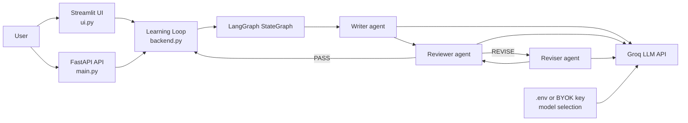
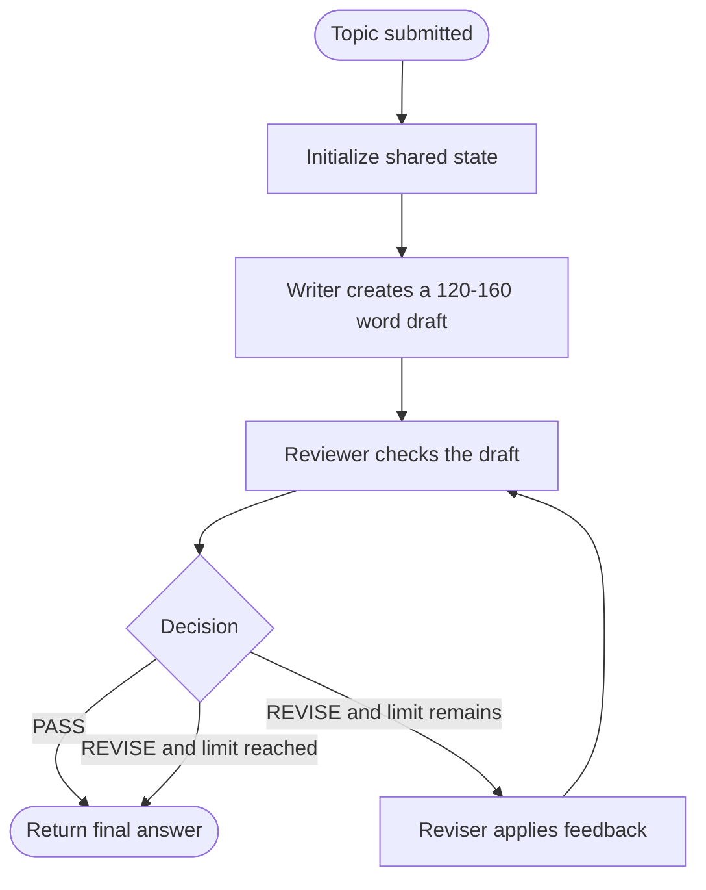

# Loop Engineering

A learning project that demonstrates a self-correcting multi-agent workflow:

**Writer -> Reviewer -> Reviser**

The writer creates a beginner-friendly explanation, the reviewer checks it against
quality rules, and the reviser improves it when necessary.

## Features

- LangGraph workflow with writer, reviewer, and reviser agents
- Groq model integration through LangChain
- Streamlit UI with BYOK (Bring Your Own Key) support
- Runtime model selection and account model discovery
- FastAPI endpoints for programmatic access
- Configurable revision limit

## Project structure

```text
backend.py       Core LangGraph workflow and Groq model integration
ui.py            Streamlit user interface
main.py          FastAPI application
requirements.txt pip dependencies
pyproject.toml   Project metadata and dependencies
.env.template    Example environment configuration
```

## Requirements

- Python 3.12+
- A Groq API key, supplied through `.env` or the Streamlit BYOK field

## Local setup

Create and activate a virtual environment, then install the dependencies:

```bash
python -m venv .venv
source .venv/bin/activate       # macOS/Linux
.venv\Scripts\activate          # Windows PowerShell
pip install -r requirements.txt
```

Copy `.env.template` to `.env` and add your key:

```env
GROQ_API_KEY=your_groq_api_key_here
GROQ_MODEL=llama-3.3-70b-versatile
GROQ_MODELS=llama-3.3-70b-versatile,llama-3.1-8b-instant
MAX_REVISIONS=2
```

Never commit `.env`. It is excluded by `.gitignore`.

## Run the Streamlit UI

```bash
streamlit run ui.py
```

Open the local URL shown by Streamlit, usually `http://localhost:8501`.

The UI allows you to enter a topic, provide a Groq BYOK key, load models available
to your account, and inspect every writer/reviewer/reviser step.

## Run the FastAPI service

```bash
uvicorn main:app --reload
```

The API is available at `http://127.0.0.1:8000`.

Interactive API documentation:

```text
http://127.0.0.1:8000/docs
```

### Endpoints

| Method | Endpoint | Purpose |
| --- | --- | --- |
| GET | `/health` | Service health check |
| GET | `/models` | List configured models |
| POST | `/run-loop` | Run the learning loop |

Example request:

```bash
curl -X POST http://127.0.0.1:8000/run-loop \
  -H "Content-Type: application/json" \
  -d '{"topic":"What is an AI agent?","model":"llama-3.3-70b-versatile"}'
```

The `api_key` field is optional. If omitted, the API uses `GROQ_API_KEY` from the
environment. For `/models`, an account-specific model list can be requested with
the `X-Groq-API-Key` header.

## System design

### High-level architecture



The Streamlit UI and FastAPI service are two entry points into the same workflow.
The UI runs the loop directly, while the API exposes the loop for other clients.

### Learning-loop workflow



Each graph run carries `topic`, `draft`, `feedback`, `decision`, and
`revision_count` in its shared state.

### Request flow

1. A user submits a topic through Streamlit or `POST /run-loop`.
2. The selected model and API key are passed to the backend.
3. The writer generates the first draft through Groq.
4. The reviewer returns a structured decision and feedback.
5. If the decision is `REVISE`, the reviser updates the draft and sends it back
   to the reviewer.
6. The loop stops when the answer passes or `MAX_REVISIONS` is reached.
7. The final answer and workflow events are returned to the caller.


## License

This project is provided as-is for learning and experimentation.
